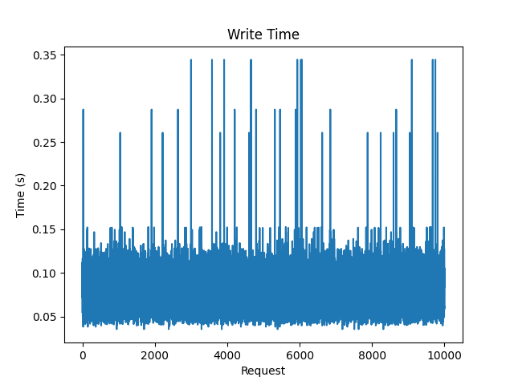
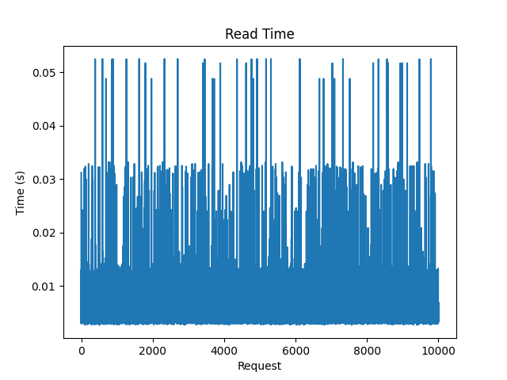
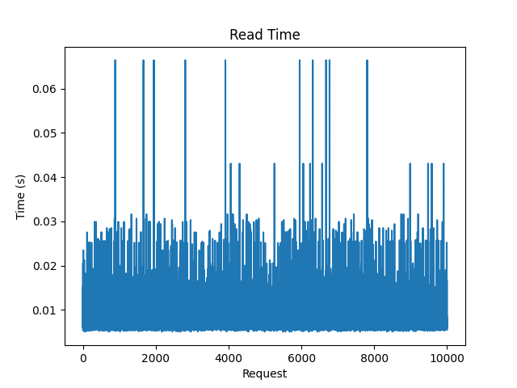
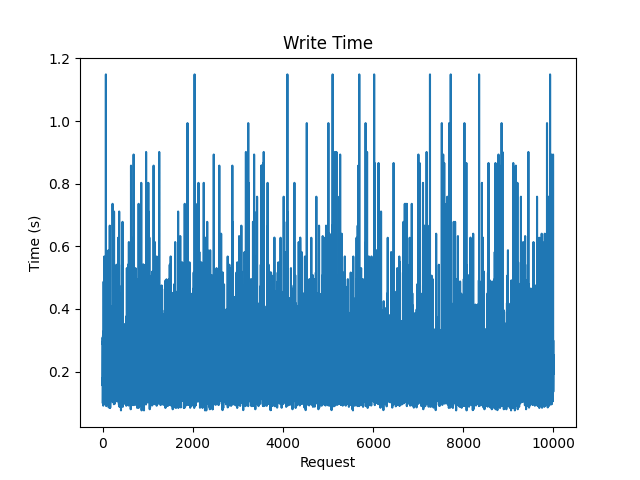
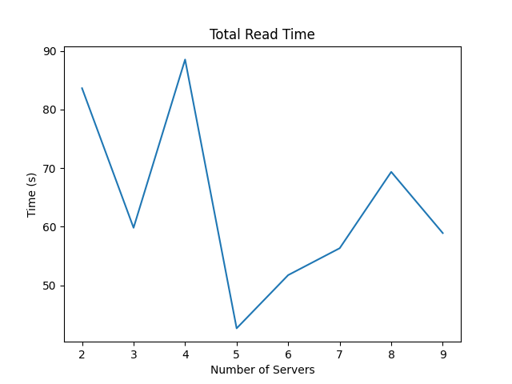
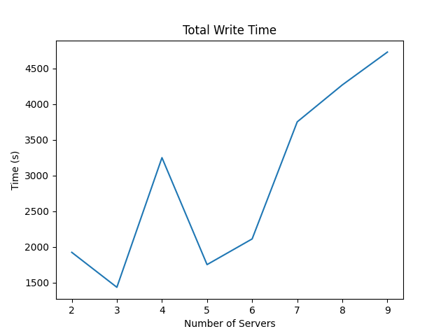
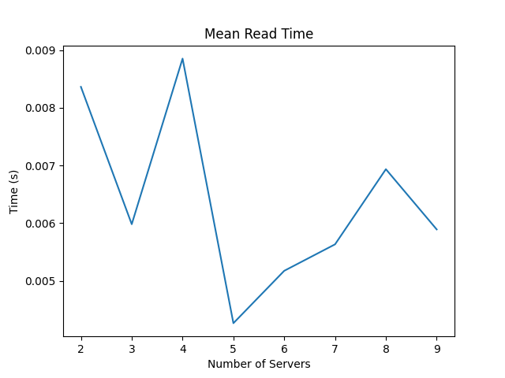
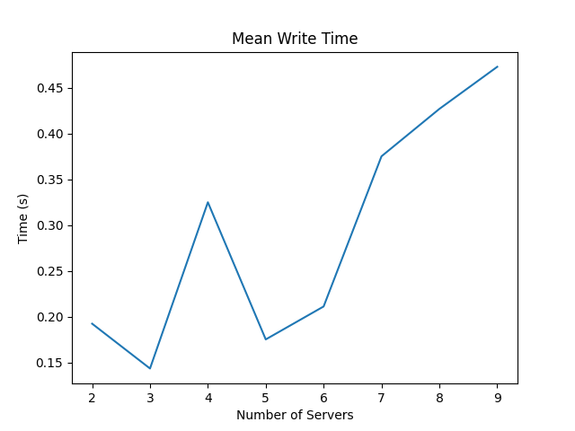
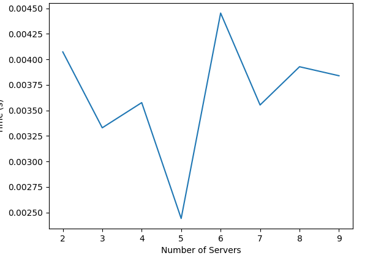
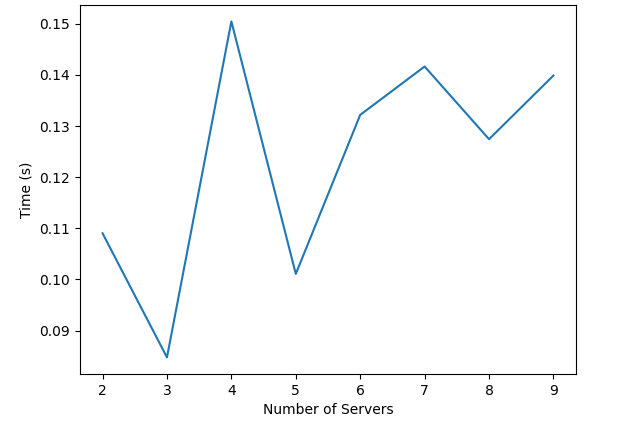

## images: Analysis

### A-1: 
- read time(Total): 74.218  sec
- write time(Total): 753.79  sec
- read time(Average): 0.00752  sec
- write time(Average): 0.07638  sec

    

    

### A-2:
- read time(total): 78.235  sec
- write time(total): 2217.970  sec
- read time(Average): 0.0080635  sec
- write time(Average): 0.233507  sec
    
    

### A-3:

- read time of Standard deviation:

- write time of Standard deviation :

### Note 
         - Read Time(Average) decreased in A2 wrt to A1 
         - Write Time(Average) increased in A2 wrt to A1 
         - Reason: number of the shard replicas increased drastically
